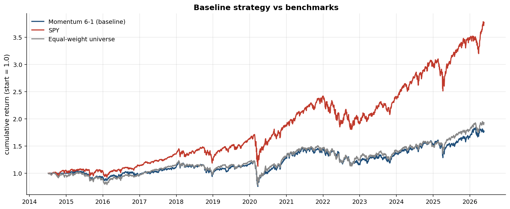
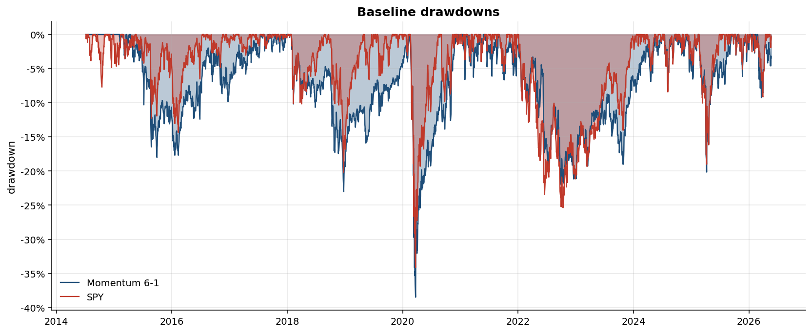
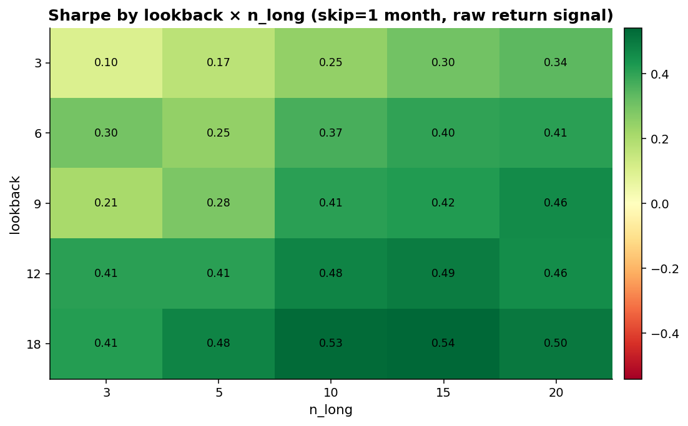
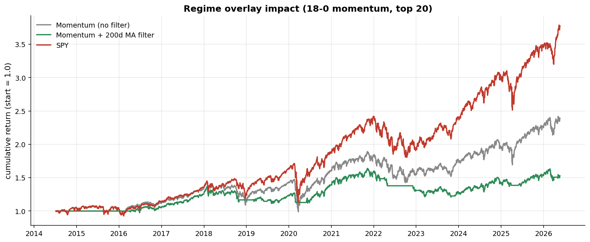
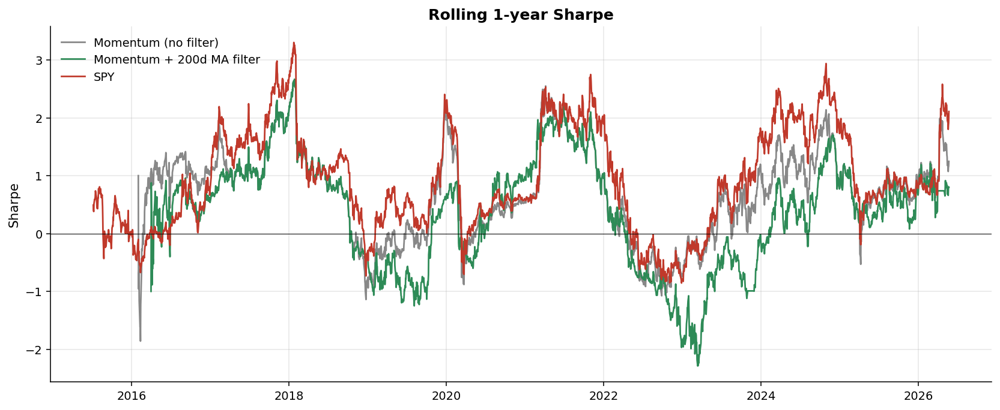
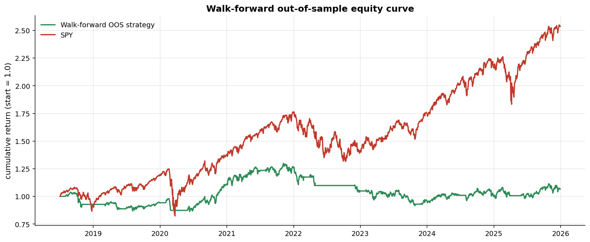
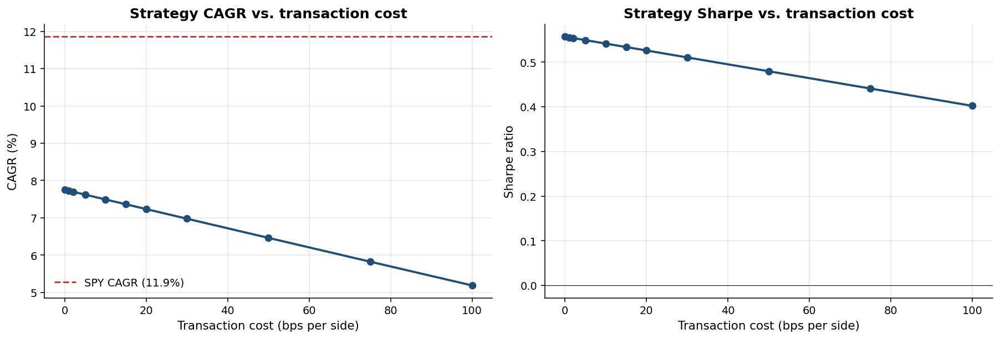
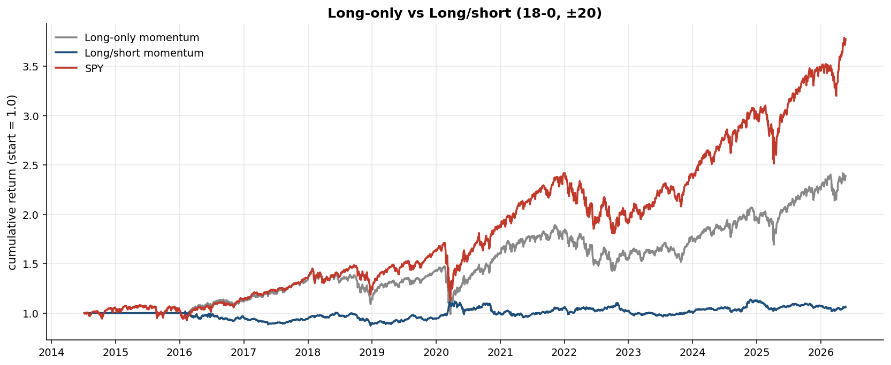

# Results — Cross-Sectional ETF Momentum

*A reproducible study of cross-sectional momentum across a 43-ETF global universe, July 2014 to May 2026.*

This document summarizes findings from `scripts/generate_results.py`. All figures and tables are regenerated end-to-end by that script — nothing here is hand-edited or hand-calculated.

---

## TL;DR

I implemented the classic Jegadeesh-Titman cross-sectional momentum strategy across a 43-ETF universe spanning regions, sectors, styles and fixed income, then put it through the full battery of tests a quant researcher should run *before* deploying anything: parameter sensitivity, regime overlays, walk-forward out-of-sample validation, factor regression, bootstrap significance testing, cost sensitivity, and a long/short variant.

The result is a project-level falsification of cross-sectional ETF momentum in this sample and regime. The two cleanest pieces of evidence:

- **The baseline strategy generates statistically significant *negative* alpha vs. SPY**: α = -4.88% annualized, t = -2.03, p = 0.042. It is destroying value relative to its market exposure.
- **The dollar-neutral long/short variant — the cleanest test of the factor itself — has α = 0.29% annualized, t = 0.13, p = 0.90.** The pure momentum factor return in this universe is statistically indistinguishable from zero.

The complete bootstrap CIs and regression results are in Sections 6 and 7 below. Sections 1–5 establish the strategies under test; Sections 8–9 examine cost sensitivity and the long/short variant.

---

## 1. Universe and data

43 ETFs covering global equity exposures, with daily closes from Bloomberg Terminal between July 3, 2014 and May 22, 2026. Categories: 10 US sectors, 8 US style ETFs, 9 single-country ETFs, 3 international style ETFs, 2 developed-market broad ETFs, 2 emerging-market ETFs, 2 fixed-income ETFs, plus regional, REIT and global exposures.

The panel is fully balanced — every ticker has ~2,990 observations across the same date range. One unadjusted IWF 4-for-1 split (2025-12-31) was back-adjusted during cleaning; see `data/splits_applied.csv` for the audit log.

## 2. Baseline strategy

| Parameter | Value |
|---|---|
| Signal | 6-month total return, skipping the most recent month |
| Portfolio | Long top 10, equal-weighted |
| Rebalance | Month-end |
| Transaction cost | 5 bps per side (10 bps round-trip) |
| Universe | All 43 ETFs |

This is the configuration most directly traceable to Jegadeesh and Titman (1993), adapted from individual stocks to an ETF universe.



| | CAGR | Vol | Sharpe | Max DD | Calmar |
|---|---|---|---|---|---|
| **Momentum 6-1 (baseline)** | 4.95% | 17.3% | 0.37 | -38.5% | 0.13 |
| SPY | 11.86% | 17.5% | 0.73 | -34.1% | 0.35 |
| Equal-weight universe | 5.69% | 16.5% | 0.42 | -36.9% | 0.15 |

The baseline underperforms both SPY and the naive equal-weight benchmark. Turnover averaged 64% per month — at 5 bps per side, that's about 7.7% per year of friction (see Section 8 for the formal sensitivity analysis).



## 3. Parameter sensitivity

A grid search over lookback ∈ {3, 6, 9, 12, 18}, skip ∈ {0, 1}, and N ∈ {3, 5, 10, 15, 20} — 50 combinations — to see whether the baseline is just an unlucky parameterisation.



Three patterns:
- **Lookback dominates.** Sharpe rises monotonically from ~0.10 (3 months) to ~0.55 (18 months).
- **Diversification helps.** Best Sharpes cluster at N = 15–20.
- **The 1-month skip barely matters** in an ETF universe — the short-term reversal effect that motivates it is weaker here than at the individual-stock level.

The best raw-momentum parameterisation: **18-month lookback, no skip, top 20**, Sharpe 0.55, CAGR 7.6%. Full sweep: `reports/tables/02_sensitivity_raw.csv`.

## 4. Risk-adjusted variant

Replacing the raw return signal with `return / realized volatility` gives a modest further bump:

| | Sharpe | CAGR | Max DD |
|---|---|---|---|
| Best raw momentum (18-0, N=20) | 0.55 | 7.6% | -33% |
| Best risk-adjusted momentum (18-0, N=3) | 0.59 | 8.4% | -21% |

Full sweep in `reports/tables/03_sensitivity_risk_adjusted.csv`.

## 5. Regime overlay: 200-day MA trend filter

A common practitioner enhancement: hold positions only when SPY is above its 200-day moving average; otherwise sit in cash.



| | CAGR | Vol | Sharpe | Max DD | Invested |
|---|---|---|---|---|---|
| Momentum 18-0 (no filter) | 7.6% | 15.6% | 0.55 | -33% | 100% |
| Momentum 18-0 + 200d MA filter | 3.6% | 11.1% | 0.38 | -26% | 82% |
| SPY | 11.9% | 17.5% | 0.73 | -34% | — |

**The filter destroys more return than risk.** Sharpe falls. Vol falls (good), but CAGR is cut in half (bad). The 200-day MA is a *lagging* signal — it goes risk-off mid-drawdown and re-enters mid-recovery, costing the strategy in 2018-Q4, 2020-Q2 (COVID), and 2022-Q4.



## 6. Walk-forward out-of-sample validation

In each of five rolling windows, parameters are chosen on a 4-year training window and traded forward 1.5 years out-of-sample with the regime filter applied.

| Segment | Train | Test | Best params | IS Sharpe | **OOS Sharpe** | OOS CAGR |
|---|---|---|---|---|---|---|
| 1 | 14-07 → 18-07 | 18-07 → 20-01 | 6-0, N=10 | 0.46 | **-0.33** | -3.9% |
| 2 | 16-01 → 19-12 | 20-01 → 21-07 | 6-0, N=15 | 0.74 | **+1.28** | 19.6% |
| 3 | 17-07 → 21-07 | 21-07 → 22-12 | 6-0, N=5 | 0.62 | **-0.90** | -10.3% |
| 4 | 18-12 → 22-12 | 22-12 → 24-07 | 9-0, N=10 | 0.62 | **-0.14** | -2.5% |
| 5 | 20-07 → 24-06 | 24-07 → 25-12 | 6-0, N=5 | 0.69 | **+0.33** | 3.7% |
| **Stitched OOS** | — | — | — | — | **0.13** | 0.9% |



In-sample Sharpe ≈ 0.6 collapses to 0.13 out-of-sample. Three of five segments produced negative OOS returns. SPY over the same window: Sharpe 0.73.

## 6.5 Are these Sharpes statistically distinguishable from zero?

Point estimates of Sharpe ratios are noisy. To test whether the differences across strategies are real or sampling noise, I compute 95% confidence intervals using a circular block bootstrap with 21-day blocks (matching the monthly rebalance cycle) and 2,000 replicates.

| Strategy | Sharpe | 95% CI | Includes 0? |
|---|---|---|---|
| Momentum 6-1 (baseline) | 0.37 | [-0.15, +0.93] | **Yes** |
| Momentum 18-0 (best in-sample) | 0.55 | [+0.03, +1.14] | No |
| Momentum 18-0 + 200d MA filter | 0.38 | [-0.11, +0.87] | **Yes** |
| Walk-forward OOS | 0.13 | [-0.50, +0.78] | **Yes** |
| SPY | 0.73 | [+0.18, +1.31] | No |
| Equal-weight universe | 0.42 | [-0.13, +0.99] | **Yes** |

The interpretation is uncomfortable. **Four of the six strategies, including the entire OOS exercise, have Sharpe CIs that contain zero.** Only SPY and the best in-sample optimised strategy are statistically distinguishable from a coin flip — and the latter is by definition overfit (it's the maximum across 50 grid points). After accounting for multiple-testing, even the best-in-sample result is questionable.

Note also that all of the momentum CIs *overlap* with SPY's CI: from a strict significance standpoint, there is no statistical evidence that any of these momentum variants underperforms SPY either. The reason is that the sample is short (~12 years) and 95% CIs on Sharpe ratios with this many observations are roughly ±0.5 wide. **What we *can* say definitively is that there is no statistical evidence that momentum *outperforms* SPY in this sample.**

The single-factor regression below is more powerful because it conditions on market beta and can identify smaller alpha effects with the same sample size.

## 7. Factor regression: does momentum add value beyond market beta?

A direct test of "alpha" rather than absolute return: fit `r_strat = α + β·r_SPY + ε` with HAC (Newey-West) standard errors to account for residual autocorrelation.

| Strategy | α (ann.) | α t-stat | α p-value | β | β t-stat | R² |
|---|---|---|---|---|---|---|
| Momentum 6-1 (baseline) | **-4.88%** | -2.03 | **0.042** | 0.88 | 25.9 | 0.79 |
| Momentum 18-0 (best IS) | -1.65% | -0.83 | 0.41 | 0.80 | 28.3 | 0.81 |
| Momentum 18-0 + 200d MA | -0.62% | -0.24 | 0.81 | 0.38 | 6.0 | 0.35 |

This is the most important table in the report. The baseline strategy has **statistically significant negative alpha** at the 5% level. It is destroying value relative to a passive 88%-SPY/12%-cash portfolio. Parameter optimisation pulls the point estimate of α closer to zero (-1.65%) but loses statistical significance — meaning the "improvement" is mostly a beta reduction (from 0.88 to 0.80), not real alpha. The regime filter pulls beta down further (to 0.38) by holding cash a fifth of the time, but the alpha remains slightly negative.

**Across all three variants, alpha is non-positive.** The "gains" from parameter sweeping and regime filtering are entirely about reducing market exposure during a bull market, not about identifying skill.

## 8. Transaction-cost sensitivity

Where is the break-even cost level for momentum to match SPY? Spoiler: there isn't one.



| Cost (bps/side) | CAGR | Sharpe | Annual cost drag |
|---|---|---|---|
| 0 | 7.75% | 0.56 | 0.0% |
| 5 | 7.62% | 0.55 | 0.12% |
| 10 | 7.49% | 0.54 | 0.24% |
| 20 | 7.23% | 0.53 | 0.48% |
| 50 | 6.46% | 0.48 | 1.20% |
| 100 | 5.19% | 0.40 | 2.40% |

At zero transaction cost, gross strategy CAGR is 7.75% — still well below SPY's 11.86%. **The strategy could be traded for free and would still underperform SPY by ~4 ppt per year in this sample.** Cost is not the issue. The signal is.

(The monthly turnover here is 23%, which is roughly what one would expect for an 18-month lookback signal — much lower than the 64% of the 6-1 baseline.)

## 9. Long/short variant: the cleanest test of the factor itself

Cross-sectional momentum's signature claim is that *the spread between winners and losers* delivers risk-adjusted excess return — not the long leg alone, which carries a large dose of market beta. A dollar-neutral long/short portfolio isolates this spread.



| | CAGR | Vol | Sharpe | Max DD |
|---|---|---|---|---|
| Long-only momentum (18-0, top 20) | 7.6% | 15.6% | 0.55 | -33% |
| **Long/short momentum (±20)** | **0.5%** | 7.4% | **0.10** | **-14%** |
| SPY | 11.9% | 17.5% | 0.73 | -34% |

Factor regression of the long/short variant against SPY:

| α (ann.) | α t-stat | α p-value | β | R² |
|---|---|---|---|---|
| **+0.29%** | 0.13 | **0.90** | 0.04 | 0.008 |

Block-bootstrap Sharpe: 0.10, 95% CI [-0.48, +0.71], includes zero.

This is the clearest possible statement: **the dollar-neutral momentum factor in this ETF universe over 2014–2026 has no statistically detectable return.** The R² of 0.008 confirms the strategy is genuinely market-neutral (good — the engine works), and the regression is well-identified with 2,988 observations of HAC-corrected daily data. We cannot reject α = 0 at any conventional significance level.

The long-only strategy's "performance" is therefore a property of its 80%-ish beta to SPY, *not* of the momentum signal.

## 10. Why has momentum been hard in this sample?

A few candidate explanations, ranked by plausibility:

1. **US large-cap dominance.** A diversified global ETF universe systematically underweights what has worked best (SPY, QQQ). Any strategy that *spreads* across regions and styles loses to a concentrated bet on US growth. The momentum signal selects the winners *within* the universe, but the universe itself has lagged SPY.
2. **Sharp V-shaped reversals.** 2018-Q4, 2020-Q1, and 2022 all featured fast bottoms that whipsaw both trend filters and cross-sectional momentum.
3. **Compressed dispersion in ETFs vs. stocks.** ETFs are themselves diversified baskets. The cross-sectional spread between winners and losers is mechanically smaller than for individual stocks — which compresses the signal-to-noise ratio.
4. **Post-2008 monetary regime.** The literature documents momentum crashes during sharp reversals and weakened performance during the QE era. Asness et al. found the effect persists across markets and time, but the standard errors in any 12-year sample are wide enough to dwarf the historical premium.

The factor literature gives us the prior: long-term cross-sectional momentum has delivered ~0.4 Sharpe net of costs over the very-long run. With ~12 years of data, the standard error on a Sharpe estimate is roughly 0.3, so even a *true* Sharpe of 0.4 would routinely produce sample estimates anywhere from 0 to 1.0. Our point estimate of 0.10 on the long/short variant is consistent with that prior, with a wide CI — it neither validates nor falsifies the academic claim. **What it does definitively rule out is the existence of a tradable edge in this universe and sample.**

## 11. What I'd do next

If I were continuing this as professional research:

1. **Combine momentum with value.** Asness, Moskowitz and Pedersen (2013) show that momentum and value are negatively correlated, and the joint factor has a substantially higher Sharpe than either alone. This is the single most-tested extension.
2. **Time-series momentum** (Moskowitz, Ooi, Pedersen 2012). Each ETF is held only when it's above its own trailing average. Different empirical animal, often complementary.
3. **Within-category ranking.** Rank ETFs against their category peers (US sectors against other US sectors, country ETFs against other country ETFs), then combine. This removes the systematic US-large-cap underweight identified in Section 10.
4. **Extend the sample backwards.** 12 years is too short to detect a Sharpe < 0.5 with confidence. Splicing in pre-ETF index data (e.g., total-return MSCI region indexes) would more than double the sample.
5. **Test the same signals on individual stocks** — the universe where the academic literature is strongest. If momentum doesn't work on ETFs but works on stocks in the same period, we learn that the dispersion-compression hypothesis (Section 10.3) is the binding constraint.

## Reproducibility

```bash
make install     # install deps
make test        # run pytest suite (26 tests)
make results     # regenerate every chart and table
```

All outputs land in `reports/figures/` and `reports/tables/`. Bootstrap CIs use a fixed RNG seed (42) and so reproduce exactly.

## References

- Jegadeesh, N. and Titman, S. (1993). "Returns to Buying Winners and Selling Losers: Implications for Stock Market Efficiency." *Journal of Finance*, 48(1).
- Asness, C., Moskowitz, T., and Pedersen, L. (2013). "Value and Momentum Everywhere." *Journal of Finance*, 68(3).
- Moskowitz, T., Ooi, Y. and Pedersen, L. (2012). "Time Series Momentum." *Journal of Financial Economics*, 104(2).
- Daniel, K. and Moskowitz, T. (2016). "Momentum Crashes." *Journal of Financial Economics*, 122(2).
- Faber, M. (2007). "A Quantitative Approach to Tactical Asset Allocation." *Journal of Wealth Management*, 9(4).
- Politis, D.N. and Romano, J.P. (1992). "A Circular Block-Resampling Procedure for Stationary Data." *Exploring the Limits of Bootstrap*.
- Newey, W.K. and West, K.D. (1987). "A Simple, Positive Semi-Definite, Heteroskedasticity and Autocorrelation Consistent Covariance Matrix." *Econometrica*, 55(3).
