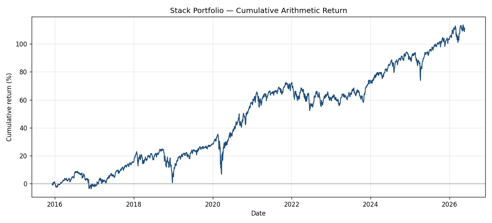
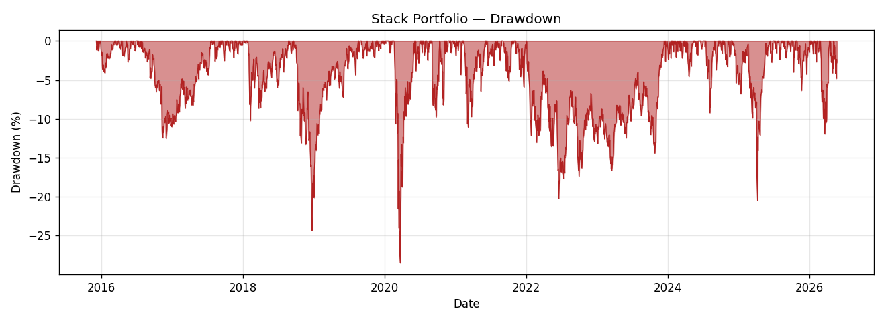

# Stack Portfolio — Reproduction Results (Phase 1)

A Python reproduction of an Excel "Stack Portfolio" tactical ETF allocation
backtest. The goal of Phase 1 is fidelity to the source workbook, not
improvement.

## Methodology

All series are recomputed from the raw wide-format closes in
`data/closes_wide.csv` (43 ETFs, 2014-07-03 → 2026-05-22, 2,990 trading days).
Splits are already back-adjusted in the closes; the precomputed columns in
`etf_panel.parquet` are deliberately ignored.

### Signal

Per ETF, per trading day `t`:

```
log_ret_t         = ln(close_t / close_{t-1})
vol_10_t          = rolling_std(log_ret, window=10, ddof=1) * sqrt(252)
risk_adj_return_t = log_ret_t / vol_10_t            # NaN where vol_10 == 0
slow_signal_t     = rolling_mean(risk_adj_return, window=lookback)
```

`vol_10` uses the sample standard deviation (`ddof=1`) to match Excel's
`STDEV`.

## Mechanics

Four sub-strategies run in parallel, mechanically identical except for start
date and lookback:

| Sub | Nominal start | Resolved start | Lookback (days) |
|-----|---------------|----------------|-----------------|
| A   | 2015-12-07    | 2015-12-07     | 260             |
| B   | 2015-12-11    | 2015-12-11     | 280             |
| C   | 2015-12-18    | 2015-12-18     | 300             |
| D   | 2015-12-25    | 2015-12-28†    | 320             |

†2015-12-25 is a market holiday, resolved to the next trading day.

Each sub-strategy:

1. **Rebalances every 20 trading days** counted from its resolved start.
2. At each rebalance, **ranks all 43 ETFs** by `slow_signal` and takes the
   **top 5 that are strictly positive**. Fewer than 5 positive → fewer holdings;
   empty slots remain in cash. The selected names form the *eligible roster*
   until the next rebalance — no new names join in between.
3. Holds **five $20 slots ($100 total) with no compounding**: capital resets to
   $100 each rebalance and slot dollar amounts are fixed.
4. **Between rebalances**, each slot toggles daily: when its `slow_signal > 0`
   the slot is invested and earns that day's simple close-to-close return;
   otherwise it sits in cash (0). A slot may toggle in and out repeatedly within
   a 20-day window.
5. The sub-strategy's **daily return is the sum of the five slot returns ÷ 5**.

### Timing / no-look-ahead

- A roster is *selected* using the slow signal at the rebalance close, but
  *begins accruing returns the next trading day* (positions taken at day `t`'s
  close start earning on `t+1`).
- The daily in/out toggle within a window uses the **same-day** slow signal,
  matching the Excel sheet's row-wise construction.

These two choices together reproduce the Excel headline within tolerance;
other timing combinations drift outside it.

### Combination and phase-in

The combined portfolio's daily return is the **simple mean of the
sub-strategies active that day**:

| Period | Active subs | Combined return |
|--------|-------------|-----------------|
| before 2015-12-07 | none | 0 |
| 2015-12-07 … 2015-12-10 | A | A |
| 2015-12-11 … 2015-12-17 | A, B | (A+B)/2 |
| 2015-12-18 … 2015-12-24 | A, B, C | (A+B+C)/3 |
| 2015-12-28 onward | A, B, C, D | (A+B+C+D)/4 |

Headline performance is measured from 2015-12-07 to the end of the data.

## Headline metrics

| Metric | Excel target | Reproduced | Rel. diff |
|--------|--------------|------------|-----------|
| Total return | 108.58% | 110.99% | +2.2% |
| Annualized return | 10.82% | 10.63% | −1.8% |
| Annualized volatility | 16.16% | 16.21% | +0.3% |
| Sharpe ratio | 0.67 | 0.66 | −2.1% |
| Max drawdown | −28.49% | −28.54% | +0.2% |

All five metrics fall within the ±3% relative tolerance enforced by
`tests/test_validation.py`.

## Per-sub-strategy metrics

Measured from each sub-strategy's own start date onward:

| Sub | Total | Ann. return | Ann. vol | Sharpe | Max DD |
|-----|-------|-------------|----------|--------|--------|
| A | 104.27% | 9.99% | 16.30% | 0.61 | −29.58% |
| B | 112.53% | 10.80% | 16.35% | 0.66 | −30.12% |
| C | 117.05% | 11.25% | 16.45% | 0.68 | −27.28% |
| D | 109.91% | 10.59% | 16.64% | 0.64 | −27.31% |

## Figures

### Equity curve (cumulative arithmetic return)



### Drawdown



## Reproducing

```bash
pip install -r requirements.txt
pytest tests/ -v                      # all tests incl. the CI validation gate
python scripts/run_stack_backtest.py  # regenerate figures + tables
```

Outputs land in `reports/figures/` (`equity_curve.png`, `drawdown.png`) and
`reports/tables/` (`metrics_summary.csv`, `sub_strategy_metrics.csv`).
