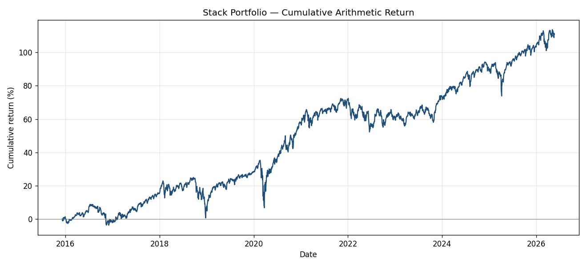
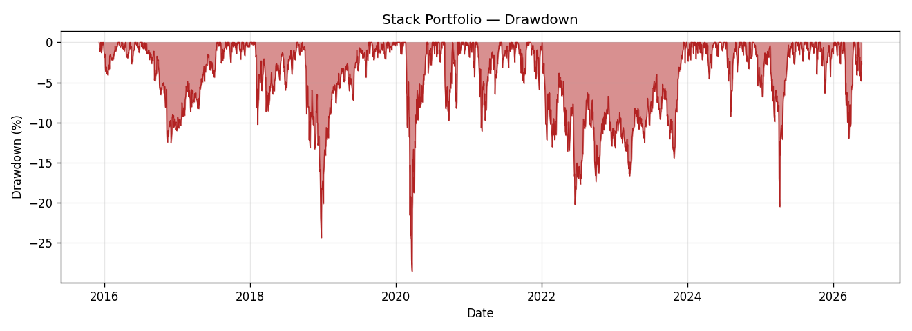
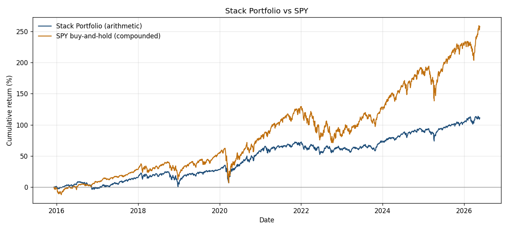
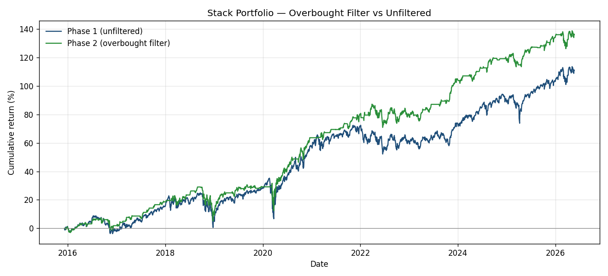
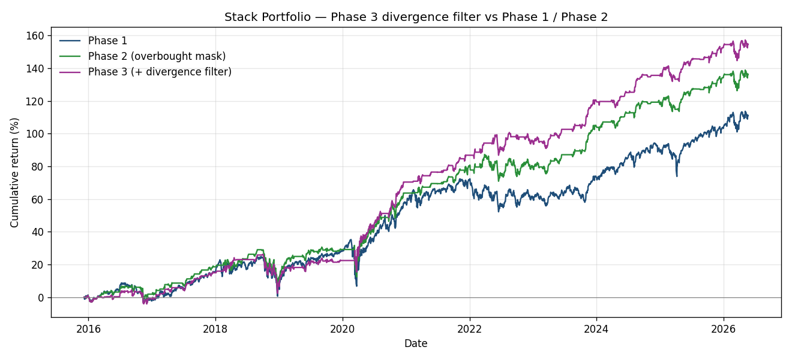
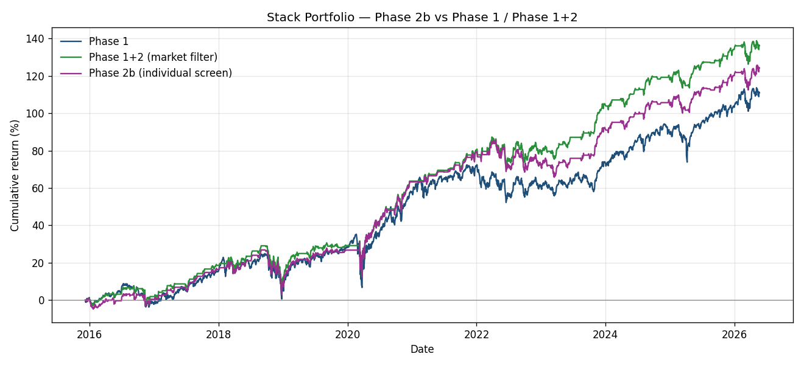
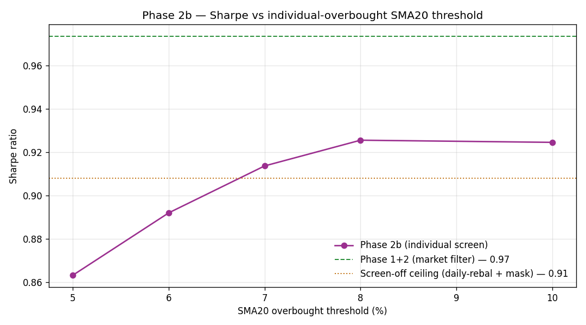

# Stack Portfolio — Reproduction Results (Phase 1)

A Python reproduction of an Excel "Stack Portfolio" tactical ETF allocation
backtest. The goal of Phase 1 is fidelity to the source workbook, not
improvement.

## Methodology

All series are recomputed from the raw wide-format closes in
`data/closes_wide.csv` (43 ETFs, 2014-07-03 → 2026-05-22, 2,990 trading days).
Splits are already back-adjusted in the closes; the precomputed columns in
`etf_panel.parquet` are deliberately ignored.

### Signal

Per ETF, per trading day `t`:

```
log_ret_t         = ln(close_t / close_{t-1})
vol_10_t          = rolling_std(log_ret, window=10, ddof=1) * sqrt(252)
risk_adj_return_t = log_ret_t / vol_10_t            # NaN where vol_10 == 0
slow_signal_t     = rolling_mean(risk_adj_return, window=lookback)
```

`vol_10` uses the sample standard deviation (`ddof=1`) to match Excel's
`STDEV`.

## Mechanics

Four sub-strategies run in parallel, mechanically identical except for start
date and lookback:

| Sub | Nominal start | Resolved start | Lookback (days) |
|-----|---------------|----------------|-----------------|
| A   | 2015-12-07    | 2015-12-07     | 260             |
| B   | 2015-12-11    | 2015-12-11     | 280             |
| C   | 2015-12-18    | 2015-12-18     | 300             |
| D   | 2015-12-25    | 2015-12-28†    | 320             |

†2015-12-25 is a market holiday, resolved to the next trading day.

Each sub-strategy:

1. **Rebalances every 20 trading days** counted from its resolved start.
2. At each rebalance, **ranks all 43 ETFs** by `slow_signal` and takes the
   **top 5 that are strictly positive**. Fewer than 5 positive → fewer holdings;
   empty slots remain in cash. The selected names form the *eligible roster*
   until the next rebalance — no new names join in between.
3. Holds **five $20 slots ($100 total) with no compounding**: capital resets to
   $100 each rebalance and slot dollar amounts are fixed.
4. **Between rebalances**, each slot toggles daily: when its `slow_signal > 0`
   the slot is invested and earns that day's simple close-to-close return;
   otherwise it sits in cash (0). A slot may toggle in and out repeatedly within
   a 20-day window.
5. The sub-strategy's **daily return is the sum of the five slot returns ÷ 5**.

### Timing / no-look-ahead

- A roster is *selected* using the slow signal at the rebalance close, but
  *begins accruing returns the next trading day* (positions taken at day `t`'s
  close start earning on `t+1`).
- The daily in/out toggle within a window uses the **same-day** slow signal,
  matching the Excel sheet's row-wise construction.

These two choices together reproduce the Excel headline closely; other timing
combinations do not.

### Combination and phase-in

The combined portfolio's daily return is the **simple mean of the
sub-strategies active that day**:

| Period | Active subs | Combined return |
|--------|-------------|-----------------|
| before 2015-12-07 | none | 0 |
| 2015-12-07 … 2015-12-10 | A | A |
| 2015-12-11 … 2015-12-17 | A, B | (A+B)/2 |
| 2015-12-18 … 2015-12-24 | A, B, C | (A+B+C)/3 |
| 2015-12-28 onward | A, B, C, D | (A+B+C+D)/4 |

Headline performance is measured from 2015-12-07 to the end of the data.

## Headline metrics

The project no longer validates against the deck's published numbers; phases are
reported empirically, and prior phases are pinned by frozen-snapshot tests
(`tests/test_phase1_frozen.py` for the Phase 1 metrics, `tests/test_validation.py`
for the Phase 1 and Phase 2 daily-return series). The table below is a
descriptive historical note documenting the original Excel reproduction.

| Metric | Excel (published) | Reproduced | Difference |
|--------|-------------------|------------|------------|
| Total return | 108.58% | 110.99% | +2.2% |
| Annualized return | 10.82% | 10.63% | −1.8% |
| Annualized volatility | 16.16% | 16.21% | +0.3% |
| Sharpe ratio | 0.67 | 0.66 | −2.1% |
| Max drawdown | −28.49% | −28.54% | +0.2% |

## Per-sub-strategy metrics

Measured from each sub-strategy's own start date onward:

| Sub | Total | Ann. return | Ann. vol | Sharpe | Max DD |
|-----|-------|-------------|----------|--------|--------|
| A | 104.27% | 9.99% | 16.30% | 0.61 | −29.58% |
| B | 112.53% | 10.80% | 16.35% | 0.66 | −30.12% |
| C | 117.05% | 11.25% | 16.45% | 0.68 | −27.28% |
| D | 109.91% | 10.59% | 16.64% | 0.64 | −27.31% |

## Figures

### Equity curve (cumulative arithmetic return)



### Drawdown



## vs SPY Benchmark

As a reference point, the Stack Portfolio is compared against a simple SPY
buy-and-hold position entered at the 2015-12-07 close and held through the end
of the data.

> **Methodology note — the two lines use different return conventions.** The
> Stack Portfolio line is **arithmetic** (a running *sum* of daily returns):
> per the spec the strategy never compounds — capital resets to $100 each
> rebalance and slot sizes are fixed. The SPY line is **compounded** (geometric
> growth of $1), because a buy-and-hold position naturally reinvests its
> profits. Consequently the SPY total/annualized figures benefit from
> compounding and are not directly comparable to the Stack's arithmetic
> figures; the comparison is indicative, not like-for-like.



| Metric | Stack Portfolio (arithmetic) | SPY (compounded) |
|--------|------------------------------|------------------|
| Total return | 110.99% | 257.88% |
| Annualized return | 10.63% | 12.99% |
| Annualized volatility | 16.21% | 17.92% |
| Sharpe ratio | 0.66 | 0.73 |
| Max drawdown | −28.54% | −34.10% |

The Stack Portfolio trails SPY on total/annualized return over this
equity-bull-market window, but does so at lower volatility and with a shallower
maximum drawdown (−28.5% vs −34.1%) — consistent with its risk-managed,
in-and-out design.

## Phase 2: Overbought Market Filter

Phase 2 layers a **purely additive overlay** on top of the Phase 1 backtest.
An exogenous binary signal (`data/overbought_signal.csv`) flags days where the
broad market is considered overbought (`market_ok == 0`). Whenever a day `T`
is flagged, the strategy sits in **cash on the four trading days `T+3`,
`T+4`, `T+5`, `T+6`** — offsets counted in the strategy's trading-day
calendar, so weekends and holidays are skipped naturally. Overlapping windows
merge: a run of consecutive 0-signal days produces a continuous cash block
from the first 0's `T+3` to the last 0's `T+6`.

The overlay is applied to Phase 1's combined daily return series; the engine,
its sub-strategies, and all Phase 1 outputs are untouched. The 3-day minimum
lag guarantees no look-ahead — the cash decision for day `t` depends only on
signal values at `t-3` and earlier. Lookback offsets that predate the filter
data, and strategy trading days that have no matching date in the filter
CSV, are both treated as `market_ok == 1` (OK to trade).

> The methodology behind how the binary signal is derived will be documented
> in a future update; for Phase 2 it is consumed as a precomputed input.

### Comparison



| Metric | Unfiltered (Phase 1) | Filtered (Phase 2) |
|--------|----------------------|--------------------|
| Total return | 110.99% | 136.18% |
| Annualized return | 10.63% | 13.05% |
| Annualized volatility | 16.21% | 13.40% |
| Sharpe ratio | 0.66 | 0.97 |
| Max drawdown | −28.54% | −23.90% |
| % of days in cash | — | 36.96% |

Over the headline window the overlay sits in cash on roughly 37% of trading
days, and on the remaining days simply passes Phase 1's return through. The
result is a higher total and annualized return with materially lower
volatility (16.21% → 13.40%) and a shallower maximum drawdown (−28.5% →
−23.9%), lifting the Sharpe ratio from 0.66 to 0.97. The filter's gains come
from sidestepping clusters of bad days rather than from amplifying good ones
— consistent with an overbought-avoidance rule.

## Phase 3: Divergence Filter (Growth Portfolio)

Phase 3 is a third **purely additive overlay**, stacked on the main line (Phase 1
base returns masked by the Phase 2 overbought filter). It is driven by a
**divergence percentile** (`data/divergence_percentile.csv` — the spread between
the top-5 and bottom-5 ETFs on the momentum signal, a fraction in `[0, 1]`).

> **Methodology note — the percentile is now reproducible from raw closes.**
> The divergence percentile was previously an exogenous, hand-supplied CSV. It is
> now recomputed in-repo from the raw closes by `src/divergence_signal.py`
> (regenerate with `scripts/build_divergence_signal.py`) on a **point-in-time,
> expanding-percentile** basis with **no look-ahead**: each day's percentile
> ranks the current divergence only against history through that day.
> `tests/test_divergence_signal.py::test_no_look_ahead_truncation_invariance`
> enforces this — truncating the input history leaves every earlier percentile
> value unchanged. The Phase 3 backtest still consumes the percentile from the
> CSV, exactly as Phase 2 consumes its overbought signal.

### Rule (market-level IN/OUT state machine)

All decisions for day `t` use information through the close of `t-1` only (T+1,
no look-ahead). The Phase 1 *unfiltered* cumulative arithmetic curve
(`base_curve`, in percentage points) runs underneath at all times.

- **Initialization** (first strategy day, 2015-12-07): IN unless the prior
  signal day's percentile is ≥ 0.85. It is 0.845, so the strategy starts IN.
- **Exit (IN → OUT)** is **edge-triggered**: it fires only on a fresh upward
  cross — `pctl[t-1] ≥ 0.85` **and** `pctl[t-2] < 0.85` — putting day `t` in
  cash. Merely staying ≥ 0.85 does not re-fire it.
- **Re-entry (OUT → IN)** fires when *either* the percentile has normalized
  (`pctl[t-1] < 0.85`) *or* `base_curve` has fallen ≥ 8 points from its peak
  since the exit.
- **Re-arm**: after any re-entry the exit can fire again only on another fresh
  upward cross, so an 8%-driven re-entry while the percentile is still elevated
  does not immediately re-exit.

0.85 exactly counts as overbought-divergent (exit uses `≥`, signal re-entry uses
strict `<`). Phase 3 sits in cash whenever the Phase 2 mask **or** the divergence
mask says cash; Phase 1 keeps running underneath throughout.

### Comparison



| Metric | Phase 1 | Phase 2 | Phase 3 |
|--------|---------|---------|---------|
| Total return | 110.99% | 136.18% | 167.85% |
| Annualized return | 10.63% | 13.05% | 16.08% |
| Annualized volatility | 16.21% | 13.40% | 12.25% |
| Sharpe ratio | 0.66 | 0.97 | 1.31 |
| Max drawdown | −28.54% | −23.90% | −18.26% |
| % of days in cash | — | 36.96% | 43.19% |

Phase 3 is in cash on 43.19% of headline trading days. Decomposing those cash
days as a share of all trading days: **32.85%** are overbought-only (Phase 2
alone), **6.24%** are divergence-only (added by Phase 3), and **4.11%** are
flagged by both. The divergence overlay therefore forces cash on 6.24 percentage
points of days the market filter left invested. Over this window, layering it on
Phase 2 raises total return (136.18% → 167.85%) and Sharpe (0.97 → 1.31), lowers
volatility (13.40% → 12.25%), and **materially reduces the maximum drawdown**
(−23.90% → −18.26%).

> **Empirical mode, no target.** Phase 3 has no published headline to match; its
> tests pin the state-machine mechanics (edge-triggered exit, dual re-entry,
> re-arm, peak tracking, the 0.85 boundary, initialization, and the T+1
> no-look-ahead lag), not production numbers.

## Phase 2b: Individual-ETF Overbought Filter

Phase 2b is a second **purely additive overlay**. Where Phase 1 rebalances every
20 trading days, Phase 2b **rebalances daily**: each of the four sub-strategies
re-ranks all 43 ETFs by its slow signal every day and holds the top five
*eligible* names. A name is eligible when its `slow_signal > 0` **and** — only on
days the exogenous analyze gate is active (`analyze == 1` in
`data/overbought_individual.csv`) — it is **not individually overbought**.

An ETF is individually overbought on a day when its close is **at or above
`1.05 ×` its 20-day SMA, or at or above `1.07 ×` its 50-day SMA** (simple moving
averages of that ETF's own close; either condition is enough). The exclusion has
**no timer** — a name is dropped only on days it is overbought and reclaims its
slot the moment it cools off. When a top name is screened out, its slot passes to
the next eligible name down the ranking; if fewer than five names are eligible,
the remaining slots are cash. As in Phase 1 the roster held on day `t` is chosen
from data through `t-1` (`roster_lag = 1`, no look-ahead), the subs combine as a
simple mean phased in by start date, and the **Phase 2 market cash mask is
applied last and unchanged**. See
[`docs/individual_overbought_methodology.md`](docs/individual_overbought_methodology.md)
for the gate and the individual-overbought test; note that six analyze dates
(2025-09-05 … 2025-09-12) are imputed.

The selection logic also exposes a `cooldown_days` parameter (default `0`, the
no-timer behavior above). The comparison below adds a **5-day cooldown** variant
— a flagged name is barred for the next five trading days even if it cools
sooner, with a fresh flag restarting the count and overlapping bars merging —
and two attribution series that isolate where the effect comes from.

### Comparison



| Metric | Phase 1 | Phase 1+2 | Phase 2b | Phase 2b + 5d cooldown | Daily-rebal + mask (screen off) | Daily-rebal (screen off) |
|--------|---------|-----------|----------|------------------------|---------------------------------|--------------------------|
| Total return | 110.99% | 136.18% | 124.30% | 120.39% | 126.80% | 108.61% |
| Annualized return | 10.63% | 13.05% | 11.91% | 11.54% | 12.15% | 10.41% |
| Annualized volatility | 16.21% | 13.40% | 13.80% | 14.34% | 13.38% | 16.08% |
| Sharpe ratio | 0.66 | 0.97 | 0.86 | 0.80 | 0.91 | 0.65 |
| Max drawdown | −28.54% | −23.90% | −24.04% | −25.82% | −24.04% | −27.88% |

The two right-hand columns are attribution series. **Daily-rebal (screen off)** —
the daily top-5 ranking with no individual screen and no market mask — lands
almost on Phase 1 (108.61% / Sharpe 0.65 vs 110.99% / 0.66), so switching from a
20-day to a daily rebalance is close to neutral on its own. **Daily-rebal + mask
(screen off)** adds the Phase 2 market mask to that daily ranking and posts the
highest Sharpe of any Phase 2b-family series (0.91); the market mask accounts for
most of the effect.

Reading across the row factually: the highest Sharpe in the table is **Phase 1+2
(0.97)**, the 20-day-rebalanced market filter. Adding the individual screen
(Phase 2b) lowers Sharpe from the 0.91 of daily-rebal+mask to 0.86 and total
return from 126.80% to 124.30% — over this window the screen does not raise
risk-adjusted return relative to the market mask alone. The **5-day cooldown is
lower than no-timer Phase 2b on every metric shown** — total return 120.39% vs
124.30%, volatility 14.34% vs 13.80%, max drawdown −25.82% vs −24.04%, Sharpe
0.80 vs 0.86 — so the fixed timer does not help here.

> **Empirical mode, no target.** Phase 2b has no published headline to match; its
> tests pin mechanics (the overbought formula and its boundaries, the analyze
> gate, daily selection / substitution / cash, the no-timer swap-back, the
> fixed-N-day cooldown and its clock reset, and the no-look-ahead lag), not
> production numbers.

### Threshold robustness

The screen's 5% / 7% cut points are arbitrary, so they were swept as a
sensitivity check — each pair run through the full Phase 2b backtest (all four
sub-strategies, screen on, no cooldown, market mask applied last) and measured
over the headline window. **This is sensitivity analysis; no threshold is adopted
and the default stays 5% / 7%.**



| SMA20% / SMA50% | Total return | Sharpe | Max drawdown |
|-----------------|--------------|--------|--------------|
| 5% / 7% (default) | 124.30% | 0.86 | −24.04% |
| 6% / 8% | 126.14% | 0.89 | −24.04% |
| 7% / 9% | 129.22% | 0.91 | −24.04% |
| 8% / 10% | 130.92% | 0.93 | −24.04% |
| 10% / 12% | 129.68% | 0.92 | −24.04% |
| *Phase 1+2 (reference)* | *136.18%* | *0.97* | *−23.90%* |
| *Screen-off ceiling — daily-rebal + mask (reference)* | *126.80%* | *0.91* | *−24.04%* |

Reading the grid factually: every swept threshold stays below the plain market
filter Phase 1+2 (Sharpe 0.97). The shipped 5% / 7% screen is the **lowest-Sharpe
point in the grid (0.86)** and sits below the screen-off reference of 0.91 — at
the default cut points the individual screen detracts relative to running no
screen at all. Loosening the thresholds raises Sharpe through 8% / 10% (0.86 →
0.89 → 0.91 → 0.93) and then flattens (10% / 12%: 0.92). Note the screened Sharpe
**exceeds** the screen-off reference at 7% / 9% and looser, so that reference —
labeled "ceiling" in the figure to match the artifact — is a reference point, not
an upper bound on the screened result. Maximum drawdown is identical (−24.04%)
across every screened threshold; the worst peak-to-trough is set by the
market-mask cash path, not by which names the individual screen drops. No swept
value is adopted; the default remains 5% / 7%.

## Reproducing

```bash
pip install -r requirements.txt
pytest tests/ -v                      # all tests incl. frozen-snapshot regression
python scripts/run_stack_backtest.py  # regenerate figures + tables
```

Outputs land in `reports/figures/` (`equity_curve.png`, `drawdown.png`,
`stack_vs_spy.png`, `stack_filtered_vs_unfiltered.png`,
`phase3_divergence_comparison.png`, `phase2b_comparison.png`) and
`reports/tables/` (`metrics_summary.csv`, `sub_strategy_metrics.csv`,
`spy_comparison.csv`, `phase2_comparison.csv`, `phase3_comparison.csv`,
`phase2b_comparison.csv`), plus the threshold sweep at
`reports/phase2b_threshold_sweep.{csv,png}`.
