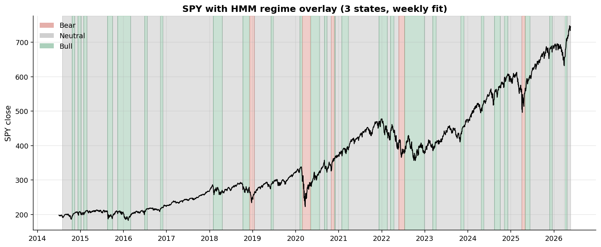
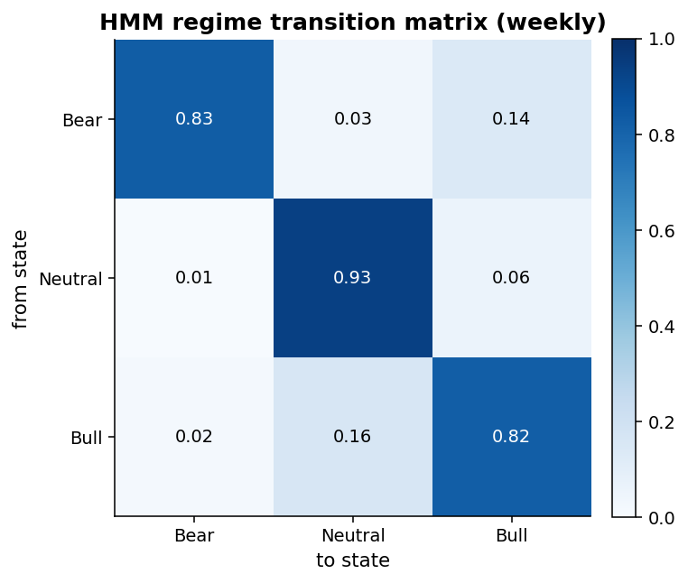

# Results v2 — Regime-Adaptive Momentum

*Adaptive variant of the cross-sectional ETF momentum strategy. 43-ETF universe, July 2014 to May 2026.*

[v1 (`RESULTS.md`)](RESULTS.md) established that vanilla cross-sectional momentum on this universe has no statistically significant alpha vs SPY (baseline α = −4.88%, p = 0.042 *negative*; walk-forward OOS Sharpe 0.13 with a 95% CI through zero; L/S factor α near zero with p = 0.90). v2 tests the hypothesis that momentum behaves **asymmetrically across market regimes**, and that a regime-conditional strategy can produce defensible alpha where the unconditional version cannot.

This document tracks the phases of that build. Phase 1 is foundation only — fit a regime detector and characterize the states. Subsequent phases consume those states inside the backtest.

---

## Phase 1 — HMM regime detection

**Driver**: [`scripts/generate_regime_overlay.py`](scripts/generate_regime_overlay.py)
**Module**: [`src/regime_hmm.py`](src/regime_hmm.py)

### Setup

A Gaussian Hidden Markov Model with `n_regimes = 3` is fit to two features on **SPY weekly** (W-FRI close):

- `ret_w` — weekly log return
- `vol_w` — 4-week rolling annualized realized volatility (factor √52)

After fitting, the three latent states are **deterministically relabeled** by mean weekly return ascending: regime 0 = lowest (bear), regime 2 = highest (bull). The model's `means_`, `_covars_`, `transmat_`, and `startprob_` are permuted to match the relabeling, so consumers of the fitted model see a single consistent state numbering.

### Regime overlay



Bear (red) bands hit every salient drawdown in the sample: the late-2018 selloff, the COVID-19 crash (2020 Q1–Q2 — the longest red band), the 2022 rates-driven decline, and the mid-2025 correction. Bull (green) periods cluster around the strong-trend stretches in 2017, 2020 Q3 (post-COVID rebound), 2023, and the 2024–2026 secular uptrend. Neutral (grey) is the modal state covering routine consolidation.

### Transition matrix



All three regimes are highly persistent (diagonal probabilities 0.82–0.93). The only meaningfully non-trivial off-diagonal transitions are Bull→Neutral (0.16) and Bear→Bull (0.14, reflecting the violent reversals that often end bear episodes — e.g., the rebound from March 2020 and from October 2022).

### Per-regime statistics

| Regime  | n_weeks | % time | Mean weekly return | Mean weekly vol (ann.) | Max drawdown in regime |
|---------|--------:|-------:|-------------------:|-----------------------:|-----------------------:|
| Bear    | 31      | 5.0%   | −0.68%             | 43.8%                  | −28.7%                 |
| Neutral | 427     | 69.2%  | +0.20%             | 8.5%                   | −12.5%                 |
| Bull    | 159     | 25.8%  | +0.43%             | 21.2%                  | −17.0%                 |

Two observations worth flagging before Phase 2:

1. The bull regime has *higher* realized vol than the neutral regime (21% vs 9%). This is not a low-vol / high-vol bear partition — it's a directional partition with vol used as a co-feature. The strongest momentum periods in this sample carry elevated realized vol from the sharpness of the up-moves.
2. The bear regime is rare (5%) but extreme. A regime-gated strategy that simply avoids the bear regime would have sidestepped roughly −29% of within-regime drawdown — assuming the regime label is available in real time, which it is *not* in Phase 1 (see caveat below).

### Important caveat — descriptive only

**Phase 1 is in-sample characterization, not a tradable signal.** The HMM is fit once on the full series and Viterbi-decoded globally — the label assigned to week W reflects the maximum-likelihood path through *all* weeks, including weeks > W. This is standard practice for descriptive regime overlays and matches what every academic regime paper plots, but it cannot be used to gate trading decisions without leaking future information.

Phase 2 will introduce an expanding-window or rolling-window fit (re-fit at each rebalance date using only data through that date) before any regime-conditional return claim is made. No alpha or backtest result is reported in Phase 1.

### Reproducing

```bash
python scripts/generate_regime_overlay.py
```

Produces:
- `reports/figures/regime_hmm_overlay.png`
- `reports/figures/regime_hmm_transition_matrix.png`
- `reports/tables/regime_hmm_summary.csv`

Deterministic with `seed=42`. Test invariants live in [`tests/test_regime_hmm.py`](tests/test_regime_hmm.py).
